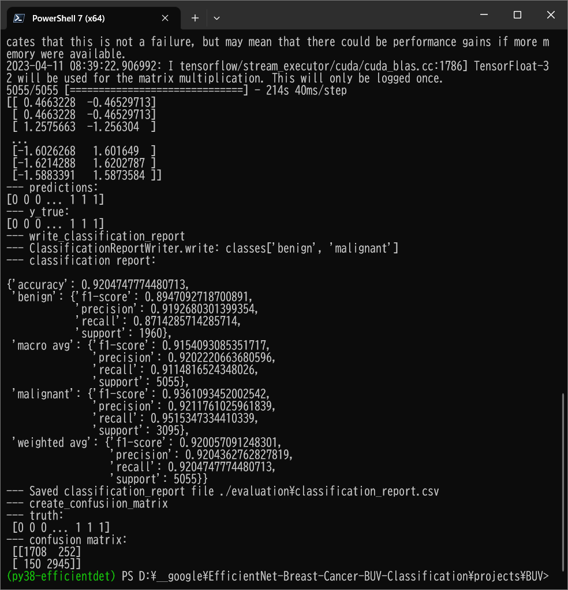

<h2>EfficientNet-BUV-Cancer (Updated: 2023/04/11)</h2>
<a href="#1">1 EfficientNetV2 Breast Cancer (BUV) Classification </a> 
<a href="#1.1">1.1 Clone repository</a> 
<a href="#1.2">1.2 Prepare Breast Cancer dataset</a> 
<a href="#1.3">1.3 Install Python packages</a> 
<a href="#2">2 Python classes for Breast Cancer Classification</a> 
<a href="#3">3 Pretrained model</a> 
<a href="#4">4 Train</a> 
<a href="#4.1">4.1 Train script</a> 
<a href="#4.2">4.2 Training result</a> 
<a href="#5">5 Inference</a> 
<a href="#5.1">5.1 Inference script</a> 
<a href="#5.2">5.2 Sample test images</a> 
<a href="#5.3">5.3 Inference result</a> 
<a href="#6">6 Evaluation</a> 
<a href="#6.1">6.1 Evaluation script</a> 
<a href="#6.2">6.2 Evaluation result</a> 

<h2>
<a id="1">1 EfficientNetV2 Breast Cancer BUV Classification</a>
</h2>

 This is an experimental Breast Cancer BUV Classification project based on <b>efficientnetv2</b> in <a href="https://github.com/google/automl">Brain AutoML</a>.
 
The dataset used here has been taken from the following Google Drive

Miccai 2022 BUV Dataset 
https://drive.google.com/file/d/1LVXK34OJhC2LkqqyMmVFnXsXQavvZdeF/view?usp=sharing 

https://github.com/jhl-Det/CVA-Net 
This repository is an official implementation of the paper A New Dataset and 
A Baseline Model for Breast Lesion Detection in Ultrasound Videos. (MICCAI-2022)

 
 We use python 3.8 and tensorflow 2.11.1 environment on Windows 11. 
 

<h3>
<a id="1.1">1.1 Clone repository</a>
</h3>
 Please run the following command in your working directory: 
<pre>
git clone https://github.com/atlan-antillia/EfficientNet-BUV-Cancer.git
</pre>
You will have the following directory tree: 
<pre>
.
├─asset
└─projects
    └─BUV
        ├─eval
        ├─evaluation
        ├─inference        
        └─test
</pre>
<h3>
<a id="1.2">1.2 Prepare Breast Cancer dataset</a>
</h3>
<h4>1 Download Dataset</h4>
Please download <b>Miccai 2022 BUV Dataset</b> from the following Google Drive.

<a href="https://drive.google.com/file/d/1LVXK34OJhC2LkqqyMmVFnXsXQavvZdeF/view?usp=sharing">Miccai 2022 BUV Dataset</a>

<h4>2 Create master dataset</h4>
 We have created <b>Miccai_2022_BUV_Dataset_master_360x360</b> from <b>Miccai 2022 BUV Dataset/rawframes</b>
by using <a href="./projects/BUV/create_master.py">create_master.py</a>
<pre>
python create_master.py
</pre>
<h4>3 Split master dataset</h4>
 We have created <b>BUV_Images</b> from <b>Miccai_2022_BUV_Dataset_master_360x360</b>
by using <a href="./projects/BUV/split_master.py">split_master.py</a>, by which we have splitted 
the master to train and test. 
<pre>
python split_master.py
</pre>

<pre>
.
├─asset
└─projects
    └─BUV
        ├─BUV_Images
        │  ├─test
        │  │  ├─benign
        │  │  └─malignant
        │  └─train
        │      ├─benign
        │      └─malignant
        └─test     
　...
</pre>

 
  
Sample images of BUV_Images/train/benign: 

  
 
Sample images of BUV_Images/train/malignant: 

  
 

The number of images in train and test dataset: 

 
 

<h3>
<a id="#1.3">1.3 Install Python packages</a>
</h3>
Please run the following commnad to install Python packages for this project. 
<pre>
pip install -r requirements.txt
</pre>
 

<h2>
<a id="2">2 Python classes for Breast Cancer Classification</a>
</h2>
We have defined the following python classes to implement our Breast Cancer Classification. 
<li>
<a href="./ClassificationReportWriter.py">ClassificationReportWriter</a>
</li>
<li>
<a href="./ConfusionMatrix.py">ConfusionMatrix</a>
</li>
<li>
<a href="./CustomDataset.py">CustomDataset</a>
</li>
<li>
<a href="./EpochChangeCallback.py">EpochChangeCallback</a>
</li>
<li>
<a href="./EfficientNetV2Evaluator.py">EfficientNetV2Evaluator</a>
</li>
<li>
<a href="./EfficientNetV2Inferencer.py">EfficientNetV2Inferencer</a>
</li>
<li>
<a href="./EfficientNetV2ModelTrainer.py">EfficientNetV2ModelTrainer</a>
</li>
<li>
<a href="./FineTuningModel.py">FineTuningModel</a>
</li>

<li>
<a href="./TestDataset.py">TestDataset</a>
</li>

<h2>
<a id="3">3 Pretrained model</a>
</h2>
 We have used pretrained <b>efficientnetv2-m</b> to train Breast Cancer FineTuning Model.
Please download the pretrained checkpoint file from <a href="https://storage.googleapis.com/cloud-tpu-checkpoints/efficientnet/v2/efficientnetv2-m.tgz">efficientnetv2-m.tgz</a>, expand it, and place the model under our top repository.

<pre>
.
├─asset
├─efficientnetv2-m
└─projects
        ├─BUV
  ...
</pre>

<h2>
<a id="4">4 Train</a>

</h2>
<h3>
<a id="4.1">4.1 Train script</a>
</h3>
Please run the following bat file to train our Breast Cancer efficientnetv2 model by using
<b>BUV/train</b>.
<pre>
./1_train.bat
</pre>
<pre>
rem 1_train.bat
; 2023/04/10 valid_data_augmentation=False
python ../../EfficientNetV2ModelTrainer.py ^
  --model_dir=./models ^
  --eval_dir=./eval ^
  --model_name=efficientnetv2-m  ^
  --data_generator_config=./data_generator.config ^
  --ckpt_dir=../../efficientnetv2-m/model ^
  --optimizer=rmsprop ^
  --image_size=360 ^
  --eval_image_size=360 ^
  --data_dir=./BUV_Images/train ^
  --data_augmentation=True ^
  --valid_data_augmentation=False ^
  --fine_tuning=True ^
  --monitor=val_loss ^
  --learning_rate=0.001 ^
  --trainable_layers_ratio=0.4 ^
  --dropout_rate=0.4 ^
  --num_epochs=50 ^
  --batch_size=4 ^
  --patience=10 ^
  --debug=True  
</pre>
, where data_generator.config is the following: 
<pre>
; data_generation.config

[training]
validation_split   = 0.2
featurewise_center = True
samplewise_center  = False
featurewise_std_normalization=True
samplewise_std_normalization =False
zca_whitening                =False
rotation_range     = 90
horizontal_flip    = True
vertical_flip      = True
 
width_shift_range  = 0.01
height_shift_range = 0.01
shear_range        = 0.00
zoom_range         = [0.4, 2.0]
data_format        = "channels_last"

[validation]
validation_split   = 0.2
featurewise_center = True
samplewise_center  = False
featurewise_std_normalization=True
samplewise_std_normalization =False
zca_whitening                =False
rotation_range     = 90
horizontal_flip    = True
vertical_flip      = True
 
width_shift_range  = 0.01
height_shift_range = 0.01
shear_range        = 0.00
zoom_range         = [0.4, 2.0]
data_format        = "channels_last"
</pre>

<h3>
<a id="4.2">4.2 Training result</a>
</h3>

This will generate a <b>best_model.h5</b> in the models folder specified by --model_dir parameter. 
Furthermore, it will generate a <a href="./projects/BUV/eval/train_accuracies.csv">train_accuracies</a>
and <a href="./projects/BUV/eval/train_losses.csv">train_losses</a> files
 
Training console output: 
 
 
Train_accuracies: 
<!--
 
-->
 

 
Train_losses: 
<!--
 
-->
 

 
<h2>
<a id="5">5 Inference</a>
</h2>
<h3>
<a id="5.1">5.1 Inference script</a>
</h3>
Please run the following bat file to infer the breast cancer in test images by the model generated by the above train command. 
<pre>
./2_inference.bat
</pre>
<pre>
rem 2_inference.bat
python ../../EfficientNetV2Inferencer.py ^
  --model_name=efficientnetv2-m  ^
  --model_dir=./models ^
  --fine_tuning=True ^
  --trainable_layers_ratio=0.4 ^
  --dropout_rate=0.4 ^
  --image_path=./test/*.png ^
  --eval_image_size=360 ^
  --label_map=./label_map.txt ^
  --mixed_precision=True ^
  --infer_dir=./inference ^
  --debug=False 
</pre>
 
label_map.txt:
<pre>
benign
malignant
</pre>
 
<h3>
<a id="5.2">5.2 Sample test images</a>
</h3>

Sample test images generated by <a href="./projects/BUV/create_test_dataset.py">create_test_dataset.py</a> 
from <a href="./projects/BUV/BUV_Images/test">BUV_Images/test</a>.
 
 

 
<h3>
<a id="5.3">5.3 Inference result</a>
</h3>
This inference command will generate <a href="./projects/Breast-Cancer/inference/inference.csv">inference result file</a>.
 At this time, you can see the inference accuracy for the test dataset by our trained model is very low.
More experiments will be needed to improve accuracy. 

 
Inference console output: 
 
 

Inference result (inference.csv): 
 
 
<h2>
<a id="6">6 Evaluation</a>
</h2>
<h3>
<a id="6.1">6.1 Evaluation script</a>
</h3>
Please run the following bat file to evaluate <a href="./projects/BUV/BUV_Images/test">
BUV_Images/test</a> by the trained model. 
<pre>
./3_evaluate.bat
</pre>
<pre>
rem 3_evaluate.bat
python ../../EfficientNetV2Evaluator.py ^
  --model_name=efficientnetv2-m  ^
  --model_dir=./models ^
  --data_dir=./BUV_Images/test ^
  --evaluation_dir=./evaluation ^
  --fine_tuning=True ^
  --trainable_layers_ratio=0.4 ^
  --dropout_rate=0.4 ^
  --eval_image_size=360 ^
  --mixed_precision=True ^
  --debug=False 
</pre>
 

<h3>
<a id="6.2">6.2 Evaluation result</a>
</h3>

This evaluation command will generate <a href="./projects/BUV/evaluation/classification_report.csv">a classification report</a>
 and <a href="./projects/BUV/evaluation/confusion_matrix.png">a confusion_matrix</a>.
 
 
Evaluation console output: 
 
 

 
Classification report: 
 
 
Confusion matrix: 
 

<h3>References:</h3>
<b>1  CVA-Net</b> 
<pre>
https://github.com/jhl-Det/CVA-Net 
This repository is an official implementation of the paper A New Dataset and 
A Baseline Model for Breast Lesion Detection in Ultrasound Videos. (MICCAI-2022)
</pre>
<h4>
Citation:
</h4>
<pre>
@InProceedings{10.1007/978-3-031-16437-8_59,
author="Lin, Zhi
and Lin, Junhao
and Zhu, Lei
and Fu, Huazhu
and Qin, Jing
and Wang, Liansheng",
editor="Wang, Linwei
and Dou, Qi
and Fletcher, P. Thomas
and Speidel, Stefanie
and Li, Shuo",
title="A New Dataset and a Baseline Model for Breast Lesion Detection in Ultrasound Videos",
booktitle="Medical Image Computing and Computer Assisted Intervention -- MICCAI 2022",
year="2022",
publisher="Springer Nature Switzerland",
address="Cham",
pages="614--623",
}
</pre>

